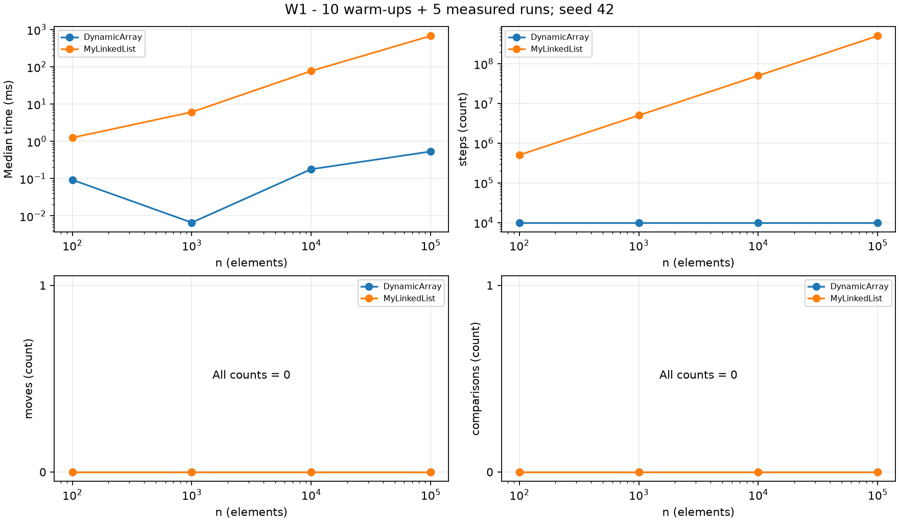
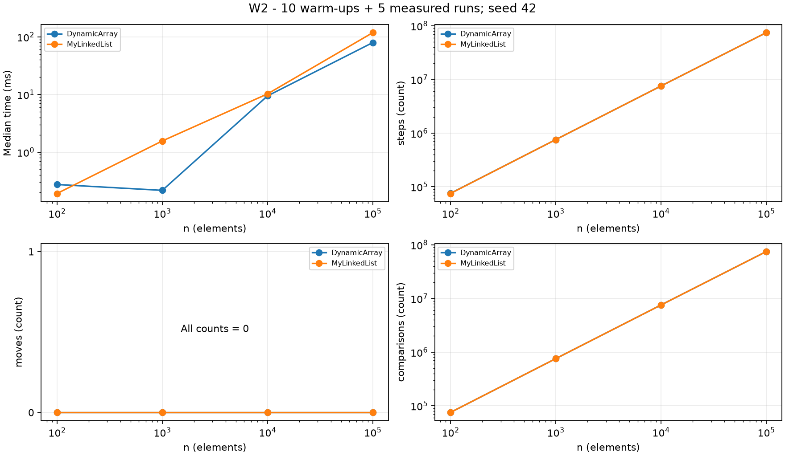
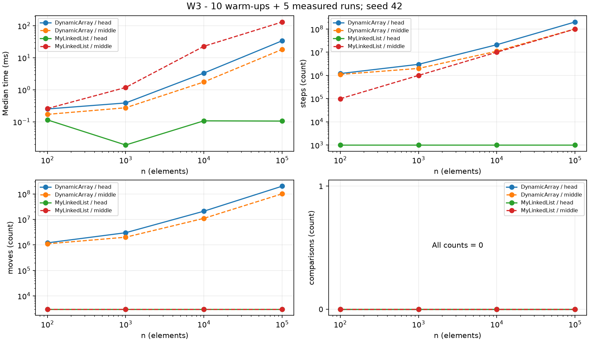
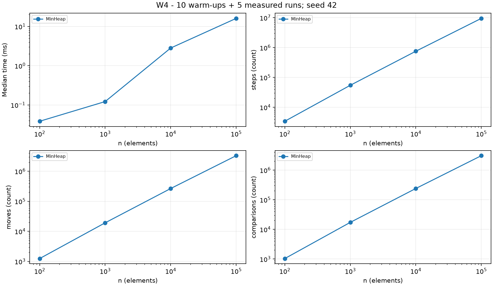

# Анализ структур данных

В проекте реализованы динамический массив, односвязный список и бинарная минимальная куча. Массив удобен для обращения по индексу, список — для изменений в начале, куча — для последовательной обработки минимальных значений. Ниже приведены свойства именно этого кода и воспроизводимый эксперимент W1–W4.

## Сложность операций

n — размер перед операцией; i — допустимый индекс. Для индексных операций средний случай предполагает равномерный выбор индекса. Для поиска предполагаются отсутствующее значение либо равномерная позиция первого совпадения, а не поиск заранее известного первого элемента. Вспомогательная память дана для одного вызова, без уже хранящейся структуры. Рост массива временно требует Θ(n) памяти.

| Структура и операция | Лучший случай | Средний случай | Худший случай | Доп. память, максимум | Обоснование |
| --- | --- | --- | --- | --- | --- |
| DynamicArray.add(x) | Θ(1) | Θ(1), амортизированно | Θ(n) | Θ(n) | При росте копируются n элементов; сумма копирований за n вставок линейна |
| DynamicArray.add(i,x) | Θ(1) | Θ(n) | Θ(n) | Θ(n) | Сдвигается n−i элементов; иногда растёт буфер |
| DynamicArray.remove(i) | Θ(1) | Θ(n) | Θ(n) | Θ(1) | Сдвигается n−i−1 элементов; буфер не уменьшается |
| DynamicArray.get(i) | Θ(1) | Θ(1) | Θ(1) | Θ(1) | Одно чтение массива |
| DynamicArray.contains(x) | Θ(1) | Θ(n) | Θ(n) | Θ(1) | Последовательный поиск до совпадения или конца |
| MyLinkedList.add(x) | Θ(1) | Θ(1) | Θ(1) | Θ(1) | Последний узел известен через tail |
| MyLinkedList.add(i,x) | Θ(1) | Θ(n) | Θ(n) | Θ(1) | Внутри списка нужен проход до i−1; начало и конец — Θ(1) |
| MyLinkedList.remove(i) | Θ(1) | Θ(n) | Θ(n) | Θ(1) | Для i>0 ищется предыдущий узел; удаление головы — Θ(1) |
| MyLinkedList.get(i) | Θ(1) | Θ(n) | Θ(n) | Θ(1) | Проход от head, точнее Θ(i+1) |
| MyLinkedList.contains(x) | Θ(1) | Θ(n) | Θ(n) | Θ(1) | Узлы проверяются последовательно |
| MinHeap.insert(x) | Θ(1) | Ω(1), O(log n), без роста | Θ(n) | Θ(n) | Подъём не более высоты; при росте копируется весь массив |
| MinHeap.peekMin() | Θ(1) | Θ(1) | Θ(1) | Θ(1) | Минимум в data[0] |
| MinHeap.extractMin() | Θ(1) | Ω(1), O(log n) | Θ(log n) | Θ(1) | Спуск по высоте кучи, буфер не уменьшается |

Θ(f(n)) одновременно означает O(f(n)) и Ω(f(n)). Для add(x) массива амортизированная оценка относится к последовательности операций, а не к каждому отдельному вызову или случайному входу. При свободной ёмкости вызов занимает Θ(1), при полном буфере — Θ(n). У кучи среднее время зависит от распределения значений и формы текущей кучи, поэтому без дополнительной вероятностной модели указаны верхняя и нижняя границы. С учётом роста insert имеет амортизированную верхнюю границу O(log n), но худший отдельный вызов — Θ(n). Для n≤1 все допустимые операции кучи константны. В служебных size() и metrics() все случаи Θ(1), память Θ(1); isValidHeap() занимает O(n), а на корректной куче Θ(n).

Структуры не уменьшают выделенные массивы: их память Θ(C), где C — ёмкость, то есть O(максимального прежнего размера + 1). Память списка Θ(n+1). Узлы содержат не только int, но и ссылку и служебные данные объекта.

## Доказательство поиска в DynamicArray

**Инвариант.** Перед итерацией с индексом i все элементы data[0..i−1] уже проверены и не равны value; 0≤i≤size.

**Инициализация.** При i=0 проверенная часть пуста, поэтому утверждение истинно.

**Сохранение.** Если data[i] равен value, метод сразу возвращает true с найденным свидетелем. Иначе data[i] тоже не равен value; после i++ утверждение остаётся истинным для расширенного префикса.

**Завершение.** В каждой продолжающейся итерации i увеличивается, а size неизменен. При i=size проверены все элементы и совпадений нет, поэтому возвращается false.

**Вывод.** Метод возвращает true только при фактическом совпадении и false только после исключения всех позиций. Следовательно, contains корректен.

## Доказательство удаления в DynamicArray

Пусть A — содержимое до операции, s — исходный размер, k — удаляемый индекс.

**Инвариант.** Перед итерацией с i значения в позициях j<k равны A[j]; для k≤j<i выполнено data[j]=A[j+1]; для i≤j<s элементы пока равны A[j]. Сохранённое removed равно A[k].

**Инициализация.** При i=k сдвинутая часть пуста; массив ещё не изменён, а удаляемое значение сохранено.

**Сохранение.** При i<s−1 значение data[i+1] ещё равно A[i+1]. Присваивание data[i]=data[i+1] делает позицию i правильной; после i++ инвариант снова верен. Необработанная часть и префикс до k не затронуты.

**Завершение.** Индекс возрастает до s−1, поэтому цикл конечен. Все позиции k..s−2 содержат нужные следующие значения. После size-- последняя старая ячейка выходит за логические границы массива.

**Вывод.** Результат содержит все исходные элементы в исходном порядке, кроме A[k]; метод возвращает именно A[k]. Удаление последнего элемента корректно и без итераций.

## Эксперимент и графики

Используются n=100, 1 000, 10 000, 100 000 и Random(42). Для каждой комбинации выполняются десять прогревочных запусков и пять измерений на новых структурах. CSV сохраняет медиану времени и реальные счётчики из методов; счётчики повторов проверяются на равенство. Время включает накладные расходы счётчиков. Это учебный бенчмарк, без изоляции JVM и аппаратных измерений кэша; повторы на другом компьютере могут отличаться.

На малых n время отдельных случаев остаётся немонотонным даже после прогрева из-за фоновой компиляции, планирования и короткой длительности замеров. Такие различия не доказывают изменение асимптотики; для неё надёжнее анализ кода и детерминированные счётчики.

W1 выполняет 10 000 случайных get. W2 выполняет 1 000 поисков: 500 существующих значений и 500 отрицательных, которых нет в данных. W3 сначала вставляет 1 000 значений, затем удаляет 1 000 значений по индексу 0 либо исходному n/2. W4 вставляет n значений в кучу и извлекает n минимумов; сортировка результата проверяется вне измеряемого участка. Начальное заполнение W1–W3, подготовка запросов и запись файлов исключены из измерений.

На каждом рисунке показаны время и три счётчика; W3 включает оба варианта. По оси n, времени и положительных счётчиков используется логарифмическая шкала. Графики с полностью нулевыми счётчиками имеют линейную шкалу и отдельную пометку. Нулевое число comparisons в W1 и W3 корректно: проверки индексов не являются сравнениями элементов.

Замер 2 октября 2026 года, Windows, OpenJDK 27: при n=100 000 W1 занял 0,532 мс у массива и 674,851 мс у списка, W2 — 79,487 и 118,180 мс. В W3 head список затратил 0,105 мс против 33,817 мс у массива; в middle массив затратил 18,201 мс, список — 130,509 мс. W4 занял 16,030 мс. Это наблюдения одного запуска с медианами пяти повторов, а не универсальные коэффициенты ускорения.

## Обсуждение

DynamicArray получает элемент по индексу одним чтением, тогда как список проходит через предыдущие узлы. При последовательном обходе соседние int лежат рядом, поэтому одна линия кэша может содержать несколько нужных значений. Пространственная локальность также помогает аппаратной предвыборке. У списка адрес следующего узла становится известен после чтения текущего, что создаёт зависимую цепочку обращений. Узлы могут располагаться далеко друг от друга, поэтому одинаковая асимптотика поиска не гарантирует одинаковое время. Кроме полезного значения узел хранит ссылку и заголовок объекта, а выравнивание может добавить память. Создание и удаление множества узлов создаёт работу для сборщика мусора, хотя конкретная пауза GC не обязана попасть в каждый замер. Даже близкие значения steps здесь не означают одинаковую машинную работу: чтение ячейки и переход по ссылке имеют разные свойства. Для вставки и удаления в голове список не обходит все n узлов и меняет лишь несколько ссылок. Массив в этом случае сдвигает почти всё содержимое, поэтому список лучше подходит для частых изменений начала. Для работы в середине этот односвязный список сначала ищет позицию, поэтому константная стоимость переподключения не делает всю операцию константной. Для частых get и компактного хранения предпочтителен DynamicArray. MinHeap подходит для планировщика, которому нужен очередной минимальный приоритет, потому что извлечение не требует полного линейного поиска. Объяснения через кэш и GC являются механизмами, согласующимися с устройством структур, но этот эксперимент не измеряет cache misses или паузы GC напрямую.

## Проверки и ограничения

JUnit 5 сравнивает случайные операции с ArrayList и PriorityQueue, проверяет пустые структуры, одиночные элементы, повторы, границы и ошибочные индексы. Для кучи инвариант parent≤child проверяется после каждой вставки и каждого извлечения; выход сравнивается с эталоном и проверяется на неубывание. Отдельные тесты проверяют численные значения счётчиков.

GitHub-ссылка, личные данные и история feature-веток не входят в этот учебный пример. Бонусы JOL и buildHeap не выполнены. Проект создан с помощью ИИ; ограничение исходного задания на использование ИИ необходимо учитывать отдельно от технических критериев.
